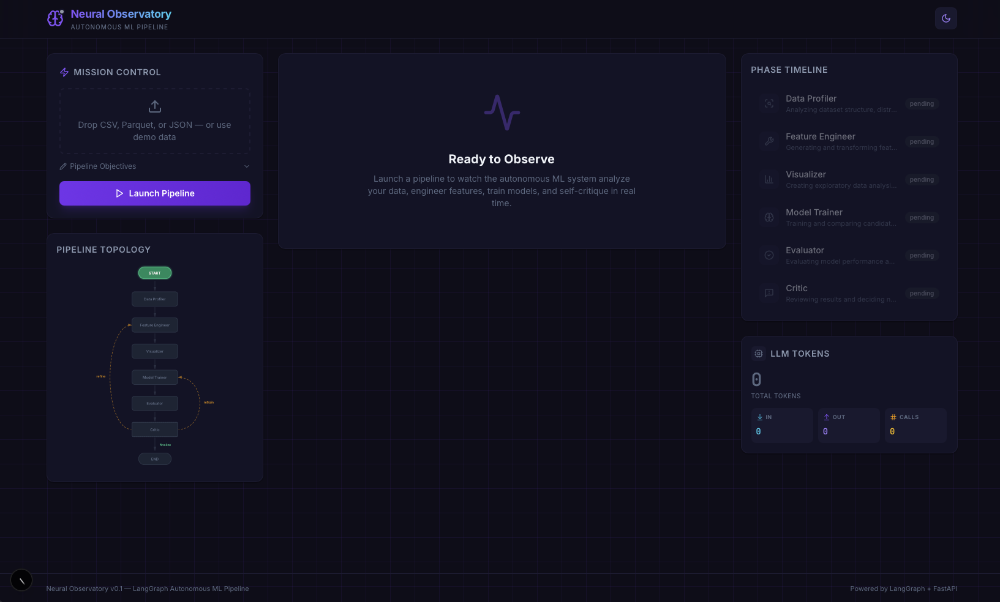
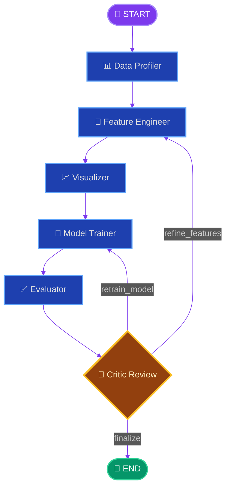
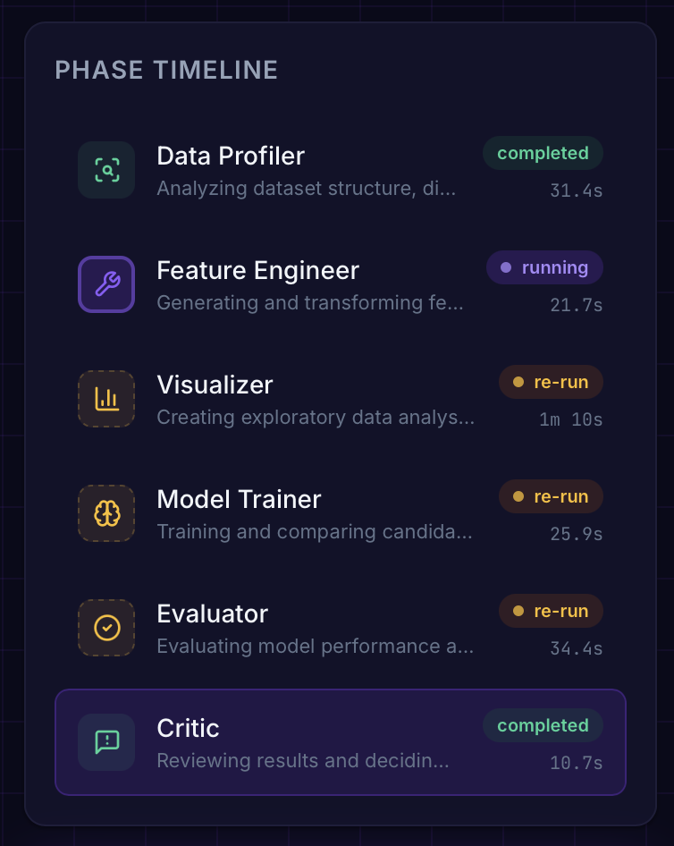
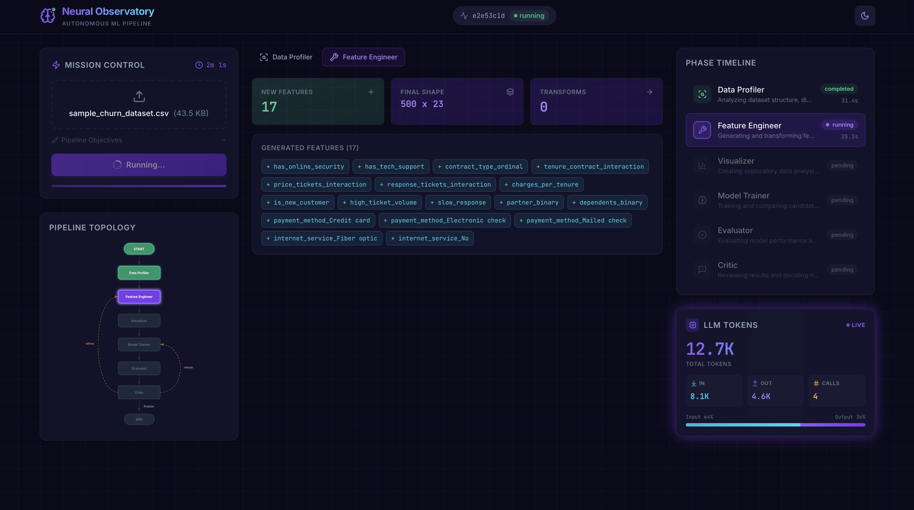

<p align="center">
  
</p>

<h1 align="center">ml-pipeline.ai</h1>

<p align="center">
  <strong>Autonomous ML Pipeline powered by LangGraph — from raw data to trained model, zero human intervention.</strong>
</p>

<p align="center">
  <a href="#architecture">Architecture</a> •
  <a href="#neural-observatory">Neural Observatory</a> •
  <a href="#pipeline-phases">Pipeline Phases</a> •
  <a href="#deployment">Deployment</a> •
  <a href="#cloud-architecture">Cloud Architecture</a> •
  <a href="#roadmap">Roadmap</a>
</p>

<p align="center">
  
  
  
  
  
  
</p>

---

## What Is This?

**ml-pipeline.ai** is a fully autonomous machine learning pipeline that takes a raw dataset and objectives in plain English, then executes the entire ML lifecycle — profiling, feature engineering, visualization, model training, evaluation — with an LLM-powered Critic that reviews results and iterates until quality thresholds are met. No notebooks. No manual tuning. Just outcomes.

This is part of a broader **AI Ecosystem** portfolio alongside [Commander.ai](https://github.com/jsbarth/Commander.ai) and [WorldMaker.ai](https://github.com/jsbarth/WorldMaker.ai), building toward a unified platform where autonomous agents collaborate across domains.

<p align="center">
  
</p>

---

## Architecture

The system is built on a **Supervisor + Specialist Node** pattern using LangGraph's `StateGraph`. A central state object flows through six specialist nodes, with a Critic node that can route execution backward for iterative refinement.



The Critic node is the differentiator. It evaluates the full pipeline state — model metrics, overfitting risk, feature quality — and decides whether to **finalize** (accept and end), **refine features** (loop back to Feature Engineering), or **retrain** (loop back to Model Training). This creates a self-improving loop bounded by a configurable `MAX_LOOPS` (default: 3).

### System Components

| Layer | Technology | Purpose |
|-------|-----------|---------|
| **Orchestration** | LangGraph `StateGraph` | DAG execution with conditional edges, checkpointing, streaming |
| **LLM** | Claude Sonnet 4.5 / GPT-4o | Code generation, analysis synthesis, critic reasoning |
| **Execution** | Subprocess sandbox | Isolated Python execution for LLM-generated code |
| **API** | FastAPI + Pydantic v2 | REST API with streaming status, plot serving, dataset upload |
| **State** | SQLite checkpointer + in-memory cache | Durable state persistence across pipeline runs |
| **Frontend** | Next.js 15 + TypeScript + Tailwind | Real-time dashboard with dark/light mode |
| **Infrastructure** | Docker Compose | Two-service deployment (backend + UI) with persistent volumes |

### Backend Structure (36 source files)

```
ml-pipeline-agent/
├── src/
│   ├── api/              # FastAPI routes, Pydantic schemas, dependency injection
│   ├── config/           # Settings (env-driven), LLM provider configuration
│   ├── graph/
│   │   ├── builder.py    # StateGraph construction + Mermaid visualization
│   │   ├── edges.py      # Conditional routing (Critic → Feature Eng / Model / END)
│   │   └── nodes/        # Six specialist nodes (one per pipeline phase)
│   ├── llm/              # Provider abstraction (Anthropic, OpenAI), prompt templates
│   ├── pipeline/         # Executor (astream orchestration), artifact storage
│   ├── sandbox/          # Code execution sandbox with validation + timeout
│   ├── state/            # PipelineState TypedDict schema — the nervous system
│   └── utils/            # Structured logging, error types
├── Dockerfile            # Production image
├── Dockerfile.dev        # Dev image with hot reload
├── docker-compose.yml    # Full stack orchestration
└── pyproject.toml        # uv-managed dependencies
```

### Frontend Structure (22 source files)

```
ml-pipeline-ui/
├── src/
│   ├── app/              # Next.js app router (layout, page, providers)
│   ├── components/
│   │   ├── layout/       # Navbar, ThemeToggle, GraphModal
│   │   ├── pipeline/     # PipelineGraph, PhaseTimeline, StatusBadge, Controls
│   │   └── results/      # Phase-specific panels (Data, Features, Viz, Model, Eval)
│   ├── hooks/            # usePipeline — polling, state transform, launch/reset
│   └── lib/              # API client, type definitions, theme utilities
├── Dockerfile.dev        # Dev image
├── next.config.ts        # API proxy rewrites (Docker-aware)
└── tailwind.config.ts    # Neural Observatory theme (custom palette, animations)
```

---

## Neural Observatory

The **Neural Observatory** is the real-time monitoring dashboard. It streams pipeline state via 2-second polling, rendering each phase as it completes — with live graph updates, animated timelines, and immediate results visualization.

### Pipeline Graph & Phase Timeline

<p align="center">
  
</p>

The left column shows the pipeline graph with node-by-node progress. The right column shows the Phase Timeline with duration tracking and loop-aware status — when the Critic triggers a re-run, completed phases show an amber "will re-run" state with pulsing indicators.

### Data Profiling

<p align="center">
  
</p>

Automated statistical profiling: shape detection, dtype analysis, missing value assessment, correlation analysis, task type inference (classification vs. regression), and target column identification. Key findings are rendered as formatted markdown from LLM synthesis.

### Feature Engineering

<p align="center">
  
</p>

LLM-generated feature transformations based on data profile insights. New columns, dropped columns, shape changes, and validation status are all tracked. The Critic may route back here if model performance is insufficient.

### Visualization (Seaborn Dark Theme)

<p align="center">
  
</p>

Automated EDA visualizations using a custom Seaborn dark theme that matches the Neural Observatory aesthetic. Charts include count plots, histograms with KDE, correlation heatmaps, violin plots, and scatter matrices — all rendered at 150 DPI with a vibrant accent palette. LLM-generated visualization code is sanitized to prevent theme overrides.

### Model Training

<p align="center">
  
</p>

Trains 3+ model candidates with cross-validation, compares accuracy/precision/recall/F1, runs Optuna hyperparameter tuning on the best candidate, and produces feature importance rankings. All metrics stream to the UI in real time as candidates are evaluated.

### Evaluation & Critic Review

<p align="center">
  
</p>

Cross-validation analysis, overfitting risk assessment, test metrics, and LLM-synthesized evaluation summaries. The Critic reviews all accumulated evidence — data quality, feature effectiveness, model performance, generalization risk — and makes an autonomous decision to finalize or iterate.

---

## Pipeline Phases

Each phase is a **LangGraph node** — a pure function that reads from `PipelineState`, executes work (usually LLM-generated Python code in a sandbox), and writes results back to state.

| Phase | Node | What It Does |
|-------|------|-------------|
| **Data Profiling** | `data_profiler` | Statistical analysis, dtype detection, missing values, correlations, task type inference |
| **Feature Engineering** | `feature_engineer` | LLM-generated feature transforms, validation, shape tracking |
| **Visualization** | `visualizer` | Seaborn EDA plots, insight synthesis, pattern detection |
| **Model Training** | `model_trainer` | Multi-candidate training, cross-validation, Optuna tuning, model serialization |
| **Evaluation** | `evaluator` | Test metrics, overfitting analysis, confusion matrices, ROC curves |
| **Critic Review** | `critic` | Holistic quality assessment, routing decision (finalize / refine / retrain) |

The Critic loop is what makes this autonomous rather than just automated. Traditional pipelines execute linearly. This one reflects, reasons about quality, and takes corrective action — up to `MAX_LOOPS` iterations.

---

## Getting Started

### Prerequisites

- Docker Desktop
- An Anthropic API key (Claude Sonnet 4.5) or OpenAI key (GPT-4o)

### Quick Start

```bash
# Clone
git clone https://github.com/jsbarth/ml-pipeline.ai.git
cd ml-pipeline.ai

# Configure
cp ml-pipeline-agent/.env.example ml-pipeline-agent/.env
# Edit .env → set ANTHROPIC_API_KEY=sk-ant-...

# Launch
cd ml-pipeline-agent
docker compose up --build -d

# Open
open http://localhost:3000
```

### Deploy Script

A `deploy.sh` script is included for versioned deployments:

```bash
./deploy.sh 10                    # Extract v10 + rebuild + restart + health check
./deploy.sh 10 --backend-only     # Backend only
./deploy.sh 10 --frontend-only    # Frontend only
./deploy.sh --rebuild             # Just rebuild containers (no extraction)
./deploy.sh                       # Interactive — lists versions, prompts
```

### Environment Variables

| Variable | Default | Description |
|----------|---------|-------------|
| `LLM_PROVIDER` | `anthropic` | LLM backend (`anthropic` or `openai`) |
| `ANTHROPIC_API_KEY` | — | Claude API key |
| `OPENAI_API_KEY` | — | OpenAI API key (if using GPT-4o) |
| `MAX_LOOPS` | `3` | Maximum Critic iteration loops |
| `SANDBOX_TIMEOUT_SEC` | `120` | Code execution timeout per phase |
| `CHECKPOINT_BACKEND` | `sqlite` | State persistence (`sqlite` or `memory`) |

---

<a name="cloud-architecture"></a>
## Cloud Architecture (AWS)

For production deployment, the system maps to a containerized AWS architecture. Given that this is a machine learning pipeline executing LLM-generated code, it is **internal-facing by design** — access should be restricted to authorized users within your organization.

```
┌─────────────────────────────────────────────────────────────────────┐
│                         AWS Cloud (VPC)                             │
│                                                                     │
│  ┌──────────────┐      ┌───────────────────────────────────────┐   │
│  │   Cognito     │      │        Private Subnets                │   │
│  │   User Pool   │      │                                       │   │
│  │  + App Client │      │  ┌─────────────┐  ┌──────────────┐   │   │
│  └──────┬───────┘      │  │  ECS Fargate │  │  ECS Fargate  │   │   │
│         │              │  │  (Backend)   │  │  (Frontend)   │   │   │
│         │              │  │  FastAPI     │  │  Next.js      │   │   │
│  ┌──────▼───────┐      │  │  Port 8000   │  │  Port 3000    │   │   │
│  │     ALB       │──────│──▶             │  │               │   │   │
│  │  (HTTPS/443)  │      │  └──────┬──────┘  └───────────────┘   │   │
│  │  + Cognito    │      │         │                              │   │
│  │    Authorizer │      │  ┌──────▼──────┐                       │   │
│  └──────────────┘      │  │    EFS       │                       │   │
│                         │  │  (Artifacts, │                       │   │
│                         │  │  Checkpoints)│                       │   │
│                         │  └─────────────┘                       │   │
│                         └───────────────────────────────────────┘   │
│                                                                     │
│  ┌──────────────┐  ┌──────────────┐  ┌─────────────────────────┐   │
│  │  Secrets Mgr  │  │  CloudWatch  │  │  S3 (Dataset Upload +   │   │
│  │  (API Keys)   │  │  (Logs +     │  │   Model Artifact Store) │   │
│  │               │  │   Metrics)   │  │                         │   │
│  └──────────────┘  └──────────────┘  └─────────────────────────┘   │
└─────────────────────────────────────────────────────────────────────┘
```

### CDK Stack Overview

A production CDK deployment would provision:

| Resource | Service | Purpose |
|----------|---------|---------|
| **Networking** | VPC + Private Subnets | Isolate all compute from public internet |
| **Auth** | Cognito User Pool + ALB Integration | JWT-based authentication — no anonymous access |
| **Compute** | ECS Fargate (2 services) | Backend (FastAPI) + Frontend (Next.js), auto-scaling |
| **Load Balancer** | ALB with HTTPS (ACM cert) | TLS termination, Cognito authorizer, path-based routing |
| **Storage** | EFS | Shared persistent storage for artifacts, checkpoints, uploaded datasets |
| **Artifacts** | S3 | Long-term model storage, dataset archive |
| **Secrets** | Secrets Manager | LLM API keys (Anthropic, OpenAI) — never in env vars |
| **Observability** | CloudWatch Logs + Metrics | Structured log aggregation, custom pipeline metrics |

### Security Considerations

This pipeline executes LLM-generated Python code in a subprocess sandbox. For production:

- **Network isolation**: Fargate tasks run in private subnets with no public IP. Outbound traffic routes through NAT Gateway (required for LLM API calls).
- **Cognito integration**: ALB Cognito authorizer gates all requests. Internal users authenticate via corporate SSO (SAML/OIDC federation).
- **Sandbox hardening**: The subprocess sandbox enforces timeouts, memory limits, and import restrictions. For defense-in-depth, consider running code execution in a separate Fargate task with a restrictive IAM role and no network access.
- **Secrets rotation**: API keys stored in Secrets Manager with automatic rotation. ECS tasks access via IAM role — no keys in environment variables or container images.

> **Note**: The Cognito + ALB integration is not yet implemented. The current deployment is intended for local Docker Desktop development. Cloud deployment infrastructure will be built as the project matures past MVP.

---

<a name="roadmap"></a>
## Roadmap

### Near-Term Enhancements

- **Human-in-the-Loop Gates** — Optional approval checkpoints before model training and finalization. The state schema already has `awaiting_human_approval` and `human_feedback` fields wired in.
- **Recall Optimization** — Improve Critic loop decision quality by tuning prompt engineering for recall-sensitive objectives. Currently deferred in favor of pipeline stability.
- **Dataset Upload UX** — Drag-and-drop dataset upload in the Neural Observatory with format detection and preview.
- **Evaluation Plots in UI** — Confusion matrices, ROC curves, and residual plots rendered inline alongside metrics.

### Medium-Term

- **Multi-Dataset Support** — Join/merge multiple datasets with LLM-inferred join keys.
- **Pipeline Templates** — Save and replay successful pipeline configurations as templates.
- **WebSocket Streaming** — Replace polling with real-time push for sub-second UI updates.
- **Model Registry** — Track, version, and compare models across pipeline runs with artifact lineage.
- **Export to Production** — Generate deployment-ready prediction code (FastAPI endpoint or Lambda function) from the trained model.

### Long-Term Vision

- **Multi-Agent Collaboration** — Specialist agents that negotiate strategy (e.g., Feature Agent proposes, Model Agent evaluates, Critic arbitrates).
- **CDK Deployment Stack** — One-command AWS deployment with Cognito, Fargate, EFS, and S3.
- **Integration with AI Ecosystem** — Connect with [Commander.ai](https://github.com/jsbarth/Commander.ai) for orchestration and [WorldMaker.ai](https://github.com/jsbarth/WorldMaker.ai) for synthetic data generation.
- **Fine-Tuned Code Generation** — Domain-specific model for generating training code, reducing token cost and improving reliability.
- **Distributed Execution** — Fan-out model training across multiple containers for parallel candidate evaluation.

---

## Tech Stack

| Category | Technologies |
|----------|-------------|
| **Orchestration** | LangGraph, LangChain Core, LangSmith (optional) |
| **LLM Providers** | Anthropic Claude Sonnet 4.5, OpenAI GPT-4o |
| **Backend** | Python 3.12, FastAPI, Pydantic v2, uv (package manager) |
| **ML / Data** | scikit-learn, XGBoost, LightGBM, Optuna, pandas, NumPy |
| **Visualization** | Seaborn, Matplotlib (custom dark theme) |
| **Frontend** | Next.js 15, TypeScript, Tailwind CSS, Lucide Icons |
| **Infrastructure** | Docker Compose, SQLite (checkpointing), structlog |

---

## Part of the AI Ecosystem

**ml-pipeline.ai** is one component of a growing portfolio of autonomous AI solutions:

| Project | Purpose |
|---------|---------|
| **[Commander.ai](https://github.com/jsbarth/Commander.ai)** | AI-powered orchestration and command framework |
| **[WorldMaker.ai](https://github.com/jsbarth/WorldMaker.ai)** | Synthetic world and data generation |
| **ml-pipeline.ai** | Autonomous machine learning pipeline (this project) |

These projects are designed to compose — each solving a distinct domain while sharing architectural patterns (LangGraph state machines, LLM-driven specialist nodes, real-time observation UIs).

---

<p align="center">
  <sub>Built with LangGraph + Claude Sonnet 4.5 + Next.js — by <a href="https://github.com/jsbarth">@jsbarth</a></sub>
</p>
